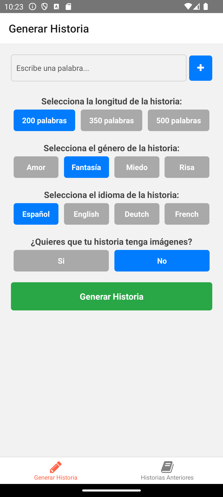
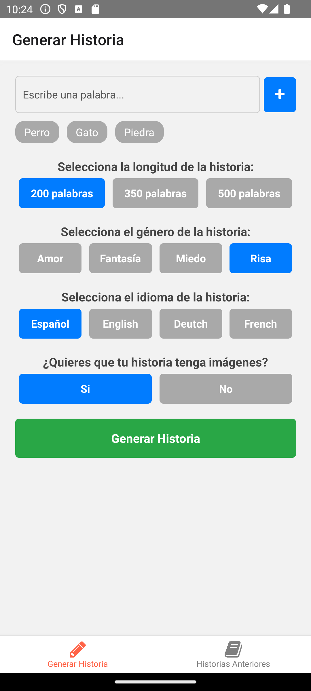
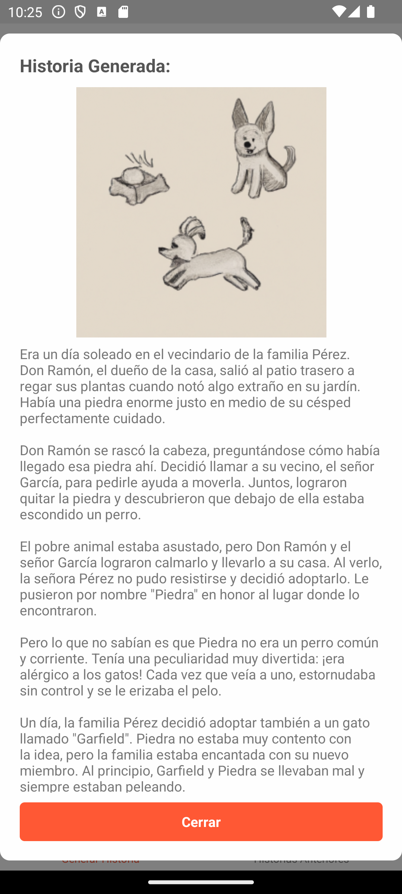
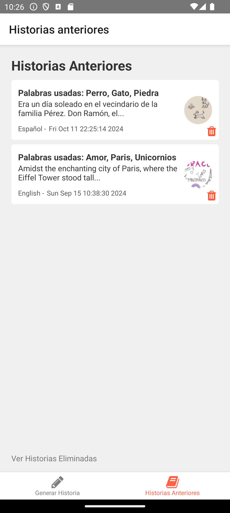
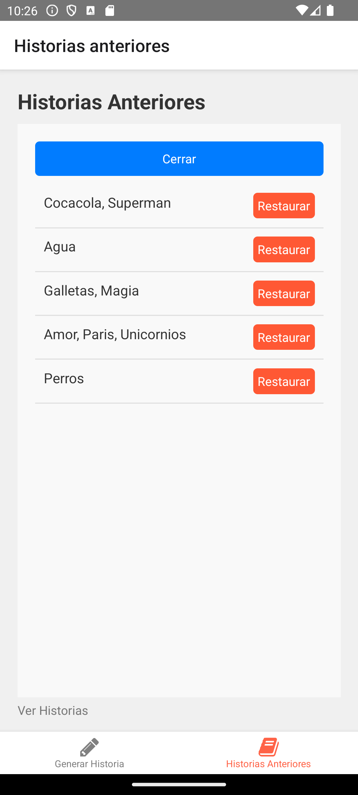

# Generador de Historias con IA

Bienvenido a la **app de Generador de Historias con IA**, una aplicación móvil que permite a los usuarios generar historias personalizadas usando inteligencia artificial (IA), con opciones de longitud, género y la posibilidad de añadir imágenes generadas automáticamente. ¡Ideal para los amantes de la escritura creativa y la narrativa!

## Índice

- [Descripción](#descripción)
- [Características](#características)
- [Capturas de Pantalla](#capturas-de-pantalla)
- [Instalación](#instalación)
- [Uso](#uso)
- [Construcción del APK](#construcción-del-apk)
- [Tecnologías Utilizadas](#tecnologías-utilizadas)
- [Licencia](#licencia)

---

## Descripción

Esta aplicación permite generar historias a partir de palabras claves elegidas por el usuario. Utiliza la API de OpenAI para generar tanto las historias como las imágenes. Los usuarios pueden elegir el género, la longitud y otras opciones para personalizar las historias generadas.

## Características

- **Generación de historias**: Personaliza la longitud de la historia (200, 350 o 500 palabras) y elige entre varios géneros (amor, fantasía, miedo, acción).
- **Imágenes generadas por IA**: Los usuarios pueden decidir si quieren que las historias incluyan imágenes generadas por IA.
- **Guardado y recuperación de historias**: Las historias generadas se pueden guardar en el dispositivo y recuperar en cualquier momento.
- **Modo de borrado lógico**: Las historias eliminadas no se borran permanentemente, pueden ser recuperadas.
- **Interfaz intuitiva**: Diseño sencillo, con navegación fácil a través de pestañas y un menú en la parte inferior.
- **Modo de visualización de historias eliminadas**: Un botón especial permite ver las historias que han sido eliminadas lógicamente.

## Capturas de Pantalla

### Pantalla de Generación de Historia
<div style="display: flex; justify-content: space-between;">
   
   
   
</div>

### Pantalla de Historias anteriores e historias eliminadas
<div style="display: flex; justify-content: space-between;">
   
   
</div>

## Instalación

### Requisitos Previos

- Node.js (v14 o superior)
- React Native CLI
- Android Studio (para Android)
- OpenAI API Key

### Clonar el Repositorio

```bash
git clone https://github.com/PokeWorldJG/HistoriesApp.git
cd HistoriesApp
```

**### Instalar dependencias**

npm install
cd android
./gradlew clean
cd ..

### Configurar la Clave de API de OpenAI

1. **Obtener la Clave de API**: Crea una cuenta en [OpenAI](https://openai.com) y genera tu API key.
2. **Añadir la Clave de API**: Sustituye la API KEY dentro del archivo openai.js en la sección de api del proyecto.
3. **Configura la base de datos SQLite**: Asegúrate de tener configurada la base de datos para guardar las historias generadas.

### Ejecución en Modo Desarrollo

```bash
npx react-native run-android
```

Asegúrate de tener un emulador de Android corriendo o un dispositivo físico conectado.

## Uso

1. **Generar una historia**: Navega a la pantalla de "Generar Historia", elige las palabras clave, longitud, género y si quieres imágenes. Pulsa en "Generar".
2. **Ver historias anteriores**: En la pantalla de "Historias Anteriores" puedes ver las historias guardadas, eliminarlas lógicamente, o ver detalles.
3. **Historias eliminadas**: Accede a las historias eliminadas lógicamente desde un botón especial en la misma pantalla de historias anteriores.

## Construcción del APK

Si deseas generar un APK de producción para instalar la aplicación en tu dispositivo:

1. **Configura la firma de la APK**:
   Sigue los pasos para generar un archivo keystore y configúralo en `android/app/build.gradle`.

2. **Genera el APK**:

```bash
cd android
./gradlew assembleRelease
```

3. **Encuentra el APK** en `android/app/build/outputs/apk/release/app-release.apk`.

4. **Instala el APK** en tu dispositivo usando ADB:

```bash
adb install android/app/build/outputs/apk/release/app-release.apk
```

## Tecnologías Utilizadas

- **React Native**: Framework principal para desarrollar aplicaciones móviles.
- **OpenAI API**: Utilizada para la generación de historias e imágenes.
- **SQLite**: Para el almacenamiento local de las historias generadas.
- **Axios**: Para las solicitudes HTTP a la API de OpenAI.


